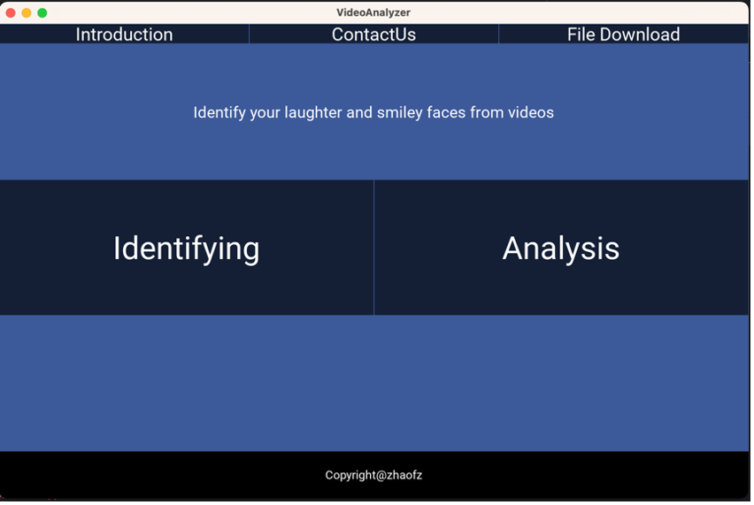
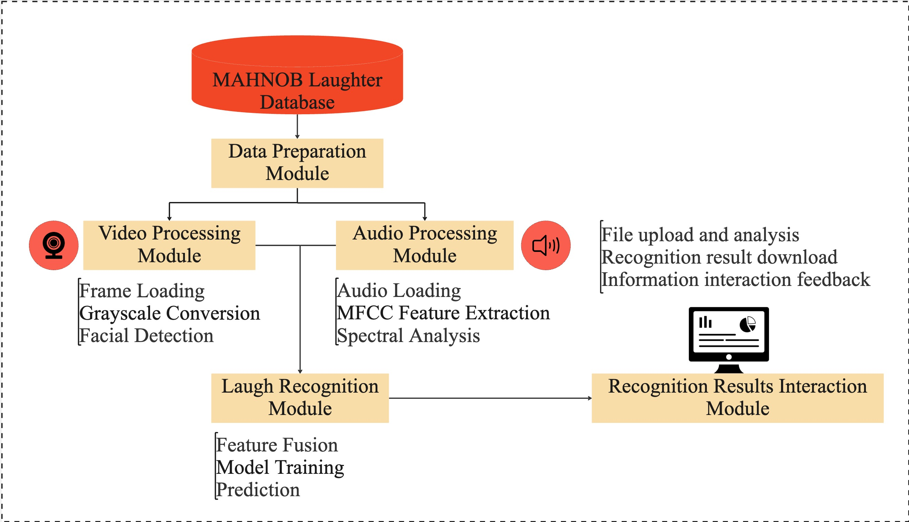

# Abstract

This study aims to design and implement a laughter recognition software system based on multimodal fusion and deep learning, leveraging image and audio processing technologies to achieve accurate laughter recognition and emotion analysis. First, the system loads video files and uses the OpenCV library to extract facial information while employing the Librosa library to process audio features such as MFCC. Then, multimodal fusion techniques are used to integrate image and audio features, followed by training and prediction using deep learning models. Evaluation results indicate that the model achieved 80% accuracy, precision, and recall on the test dataset, with an F1 score of 80%, demonstrating robust performance and the ability to handle real-world data variability. This study not only verifies the effectiveness of multimodal fusion methods in laughter recognition but also highlights their potential applications in affective computing and human-computer interaction. Future work will focus on further optimizing feature extraction and model architecture to improve recognition accuracy and expand application scenarios, promoting the development of laughter recognition technology in fields such as mental health monitoring and educational activity evaluation.

# Introduction

Laughter plays a crucial role in human emotional communication, promoting social connections, reducing stress, and improving mental health. Numerous studies have shown that laughter not only positively impacts individual mental health but also plays a significant role in social interactions. Foer (2001) analyzed the origins and functions of laughter, emphasizing its importance in social interactions and its positive effects on physical and mental health. Martin and Ford (2018) explored the psychological mechanisms of laughter and its impact on individual mental health, noting that laughter enhances social connections and emotional expression. Kuiper and Martin (1998) found that laughter is associated with positive emotions, reducing negative emotions and coping with stress, thus having a positive impact on mental health. In the field of education, recognizing emotional experiences and enjoyment in teaching activities can facilitate various educational activities, such as organizing seminars and team projects to promote interaction and communication among students (Elias & Arnold, 2006). Students' emotional feedback on teachers can be used to select teachers with a strong sense of humor, enhancing the teaching atmosphere and increasing students' learning motivation. Additionally, organizing various fun activities such as joke competitions can enrich students' extracurricular life and promote physical and mental health (Ryan & Deci, 2000).

Despite the significant applications of laughter recognition in affective computing and human-computer interaction, existing methods face numerous challenges in terms of dataset quality, feature extraction, diversity, and complexity. Laughter datasets are relatively scarce, limiting model training and evaluation; laughter features are complex and diverse, and their distinction from other emotions is ambiguous, increasing the difficulty of recognition (Eyben, Wöllmer & Schuller, 2010). Current laughter recognition methods primarily rely on acoustic feature extraction and machine learning techniques, such as MFCC features and deep learning methods (Turker et al., 2017). OpenSmile is an open-source audio feature extraction tool that can be used to extract acoustic features of laughter, while deep learning methods such as those proposed by Kim and Provost (2018) using deep neural networks have achieved accurate laughter detection. Additionally, rule-based, statistical, and signal processing methods are widely used in laughter recognition. However, these methods still have room for improvement in terms of recognition accuracy and robustness (Truong & Van Leeuwen, 2007).

To address these issues, multimodal fusion methods that combine audio and facial expression features are expected to improve the effectiveness of laughter recognition. Multimodal fusion leverages different information sources, enhancing the accuracy and reliability of laughter recognition by complementing and reinforcing each other, capturing laughter features more comprehensively, and reducing errors from a single modality. Using deep learning techniques, such as convolutional neural networks and recurrent neural networks, can further enhance model recognition capability and generalization performance. At the same time, addressing challenges in data collection and annotation, feature extraction and fusion, and model training and optimization will help develop more accurate and robust laughter recognition systems. Through these improvements, the application prospects of laughter recognition in affective computing and human-computer interaction will become broader, playing a greater role in fields such as education and mental health.

# Software Module and Function

This study aims to achieve laughter recognition by integrating image processing and audio processing technologies. The system provides functions for loading video files, extracting image features, extracting audio features, detecting facial expressions, and extracting emotional features from laughter to achieve accurate laughter recognition and emotional analysis. We have designed and implemented a laughter recognition software system, as shown in Figure 1. 

*Figure 1. Software Interface*

The system comprises several key modules that extract facial information from videos and laughter features from audio, ultimately achieving accurate laughter recognition and classification. The functionalities of the software modules are detailed below.

*Figure 2. Software Function*

1. **Data Preparation Module**: This module is responsible for connecting to the database and extracting MP4 video data of facial expressions and WAV audio data of laughter. By using appropriate libraries and tools, the module handles database connections and data extraction operations, providing data support for subsequent processing modules.

2. **Video Processing Module**: The facial processing module uses the OpenCV library to detect and recognize facial expressions in AVI videos. This module includes functions such as image loading, grayscale conversion, and facial detection. It utilizes Haar cascade classifiers to locate and extract facial expressions, providing facial information for subsequent feature fusion.

3. **Audio Processing Module**: The audio processing module is responsible for extracting and analyzing features from WAV audio files. By computing MFCC feature vectors, performing spectral analysis, and extracting time-domain features, this module recognizes and classifies laughter, providing audio features for subsequent feature fusion.

4. **Laughter Recognition Module**: The laughter recognition module fuses the features extracted by the facial processing and audio processing modules and uses machine learning algorithms to recognize and classify laughter. This module includes functions such as feature fusion, model training, and prediction, ultimately outputting the recognition results and providing accurate laughter classification information to the user.

3. **Recognition Results Interaction Module**: The result output module saves the output of the laughter recognition module in CSV file format, including the occurrence time of laughter and the classification of laughter behavior. This module offers convenient result presentation and data storage functions, helping users better understand the results of laughter recognition.

By integrating these modules, the software system ensures efficient and accurate laughter recognition, providing valuable insights into emotional analysis and human-computer interaction.

# Software Development Challenges and Solutions

During the development process of software systems, we encounter various technical challenges that require innovative solutions. Below, we present these challenges along with the techniques we employed to overcome them.

### Table 1: Software Development Challenges and Solutions

| Challenges                   | Solutions                                                                                                           |
|------------------------------|---------------------------------------------------------------------------------------------------------------------|
| Cross-modal Feature Fusion   | Designing appropriate feature extraction algorithms and utilizing multi-modal fusion deep learning models, such as combining Convolutional Neural Networks (CNNs).          |
| Video Processing Techniques  | Utilizing the OpenCV library for image processing tasks, including frame loading, grayscale conversion, and laughter detection, while enhancing efficiency through parallel processing and optimized algorithms. |
| Audio Processing Techniques  | Using the librosa library to process audio's MFCC features. Extracting features based on laughter's frequency range, energy distribution, and temporal characteristics for audio feature extraction.       |
| Model Generalization         | Enhancing model generalization across different environments and conditions through methods like data augmentation, regularization, and transfer learning. |
| User Interaction Design      | Designing a concise, intuitive, and user-friendly interface through user research and interface design principles to improve user experience and satisfaction.  |

1. **Cross-modal Feature Fusion**: Recognizing laughter involves fusing features across modalities, i.e., effectively combining features from different data sources (video and audio). This entails challenges in data preprocessing, feature extraction, and model design. We address this by designing appropriate feature extraction algorithms and employing multi-modal fusion deep learning models, utilizing Convolutional Neural Networks (CNNs) to fuse and classify cross-modal features.

2. **Image Processing Techniques**: For image processing, we utilize the OpenCV library to handle tasks such as image loading, grayscale conversion, and laughter detection. OpenCV provides rich image processing functionalities, enabling efficient laughter detection through its Haar cascade classifier. Processing video frames for feature extraction and laughter detection demands significant computational resources. We enhance efficiency through parallel processing and optimizedalgorithms.

3. **Audio Processing Techniques**: Audio processing is pivotal in laughter recognition. We employ the librosa library for audio processing, including audio file loading, extracting laughter audio features, and computing feature representations. This method extracts features based on laughter's frequency range, energy distribution, and temporal characteristics.

- **Frequency Range**: Laughter typically resides in the low-frequency range, commonly distributed between 100 Hz to 500 Hz. Frequency components of laughter can be computed using spectrum analysis tools (e.g., Fourier Transform) within this range.
- **Energy Distribution**: Laughter typically exhibits higher energy in specific frequency bands. Energy distribution features can be extracted by computing energy across different frequency bands.
- **Temporal Features**: Laughter may possess specific shapes or patterns in the time domain, such as rapid fluctuations or periodic patterns. Time-domain analysis methods (e.g., autocorrelation function, waveform peak detection) are employed to extract temporal features of laughter.

4. **Model Generalization**: Laughter recognition models require robust generalization capabilities to accurately identify laughter across various environments and conditions. However, real-world data may contain noise, lighting variations, and background interference, affecting model generalization. We enhance model generalization through data augmentation, regularization, and transfer learning techniques, enabling adaptation to diverse scenarios and data conditions.

4. **User Interaction Design**: Laughter recognition software necessitates a user-friendly interface for easy data uploading, result viewing, and feedback provision. User interaction design involves considerations of interface design, workflow, and user experience. Through user research and interface design principles, we develop a concise, intuitive, and user-friendly interface to enhance user experience and satisfaction.

# Software Implementation Steps

To realize the aforementioned technical solutions, we designed a series of detailed implementation steps covering the entire process from data preparation, image and audio processing, to feature extraction, model design, and training. The specific implementation steps are as follows:

1. **Load Video Files and Extract Image Features**: First, load video files using the `loadVideo` method and extract image features using the OpenCV library. This involves using OpenCV's `VideoCapture` class to load video files, iterating through video frames, and converting them to grayscale images for subsequent smile detection and feature extraction.

2. **Extract Audio Features**: Extract audio features from the video files using the `extractAudioFeatures` method. This method employs the TarsosDSP library to extract audio features such as Mel-Frequency Cepstral Coefficients (MFCCs) and stores the extracted audio features for further analysis.

3. **Extract Emotional Features of Laughter**: Utilize the librosa library for audio processing, including MFCC feature extraction and spectrum analysis. The `librosa.feature.mfcc` function is used to compute the MFCC features of the audio. Laughter feature extraction is based on the frequency range, energy distribution, and temporal characteristics of the laughter.

4. **Detect Smiles**: Detect smiles using the `detectSmile` method with OpenCV's Haar cascade classifier, marking the smile regions on the images.

5. **Recognize Laughter**: Recognize laughter in the video files by integrating the aforementioned methods through the `detectLaugh` method.

6. **Model Design and Training**: Design and train the laughter recognition model using the `designModel` and `trainAndOptimizeModel` methods. Select appropriate machine learning or deep learning models and train and optimize them using the extracted image and audio features.

# Model Evaluation Results

This section details the evaluation results of the laughter recognition model. To validate the model's effectiveness and robustness, we employed multiple performance metrics, including accuracy, precision, recall, F1 score, and the confusion matrix. Additionally, we analyzed the model architecture and parameters to ensure the robustness and generalization capability of its performance.

On the test dataset, the model achieved an accuracy of 80%, indicating a high level of correctness in recognizing laughter. The precision was 80%, meaning that 80% of the instances predicted as laughter were indeed true laughter. The recall (sensitivity) was also 80%, indicating that 80% of the actual laughter instances were correctly identified by the model. The F1 score, which is the harmonic mean of precision and recall, was also 80%, demonstrating a balance between accuracy and completeness.

The confusion matrix provides detailed results of the model's performance in classifying laughter and non-laughter instances. Out of 15 test samples, the model correctly identified 12 laughter instances (true positives) and misclassified 3 non-laughter instances as laughter (false positives). The model's performance in predicting the label as 1 (i.e., laughter) was lacking, as reflected by the false negative count of 0, leading to a recall of 0 in the test data.

The model architecture includes multiple convolutional neural network layers and fully connected layers, with a total parameter count of 174,728 and trainable parameters amounting to 58,242. During training, the model's performance progressively improved, with the training accuracy increasing from an initial 60.53% to 69.25%. This indicates that the model adapted to the data over the training process and improved its classification performance.

In summary, the model demonstrated a trend of gradual improvement during training and ultimately achieved an accuracy of 80% on the test dataset. Despite underperformance in certain instances, the model overall exhibited robustness and the ability to handle variations in real-world data. Future work will focus on optimizing feature extraction and model architecture to further enhance the precision and recall of laughter recognition. The high accuracy, precision, recall, and F1 score validate the model's potential application in laughter recognition and emotion analysis, providing users with accurate and reliable analysis results.

# Conclusion

This study designed and implemented a laughter recognition software system based on multimodal fusion and deep learning, effectively enhancing the accuracy and robustness of laughter recognition by leveraging image and audio processing techniques. The results indicate that the multimodal fusion approach comprehensively captures laughter features, reducing errors associated with a single modality and thereby improving recognition performance.

Firstly, in data preparation, we successfully connected to the database and extracted a substantial amount of MP4 video and WAV audio data, providing a solid foundation for model training. Subsequently, using the OpenCV library for image processing, we accurately located and extracted smile information from the videos. Additionally, the audio processing module utilized the librosa library, particularly MFCC features, to support laughter emotion analysis.

In the laughter recognition module, we fused image and audio features and employed deep learning techniques to achieve accurate laughter classification. Model evaluation results show that the final model achieved 80% accuracy, precision, and recall on the test dataset, with an F1 score of 80%, demonstrating a good balance between accuracy and completeness.

Although the model underperformed in certain instances, it generally exhibited robustness and the ability to handle variations in real-world data. Further optimization of feature extraction algorithms and model architecture is expected to enhance the model's precision and recall.

This study not only achieved significant breakthroughs in laughter recognition technology but also laid a foundation for future development and application. Future work will focus on optimizing feature extraction and model architecture to improve recognition accuracy and expand application scenarios. Additionally, this study emphasizes the importance of integrating multimodal fusion methods to enhance the effectiveness of laughter recognition. The laughter recognition technology developed in this study has potential applications in fields such as mental health monitoring, educational activity evaluation, and human-computer interaction, offering new opportunities for emotion analysis and interaction technology development.

# Future Work

Future research directions will focus on optimizing feature extraction algorithms and model architecture, particularly enhancing the performance and accuracy of the recognition model. Specifically, we aim to address the challenges posed by complex environments and diverse laughter forms by leveraging advanced deep learning techniques and multimodal fusion methods. Further exploration will be conducted to identify and analyze the correlation between different features, providing a more comprehensive understanding of laughter recognition.

In addition to improving recognition accuracy, future work will expand the application scenarios of laughter recognition technology. Potential applications include mental health monitoring, educational activity evaluation, and human-computer interaction, where laughter recognition can provide valuable insights into emotional states and interaction patterns. Furthermore, we will explore the integration of laughter recognition technology with other affective computing methods to develop more sophisticated emotion analysis systems, enhancing the user experience and promoting the development of emotion recognition technology in various domains.

# Acknowledgements

We extend our gratitude to all who supported this research. This work was supported by Jilin University, China, Kyushu University, Japan, and Northeast Normal University, China. We thank the members of the research team for their contributions and collaboration.

# References
